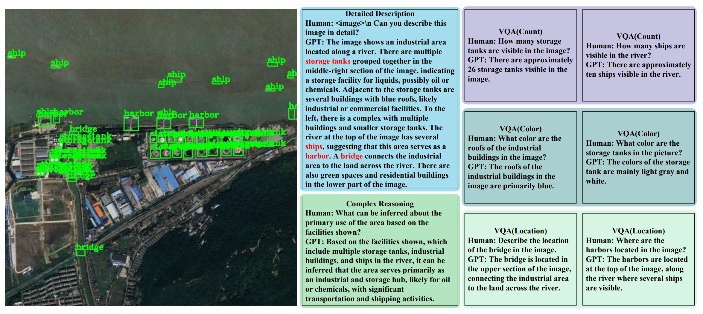
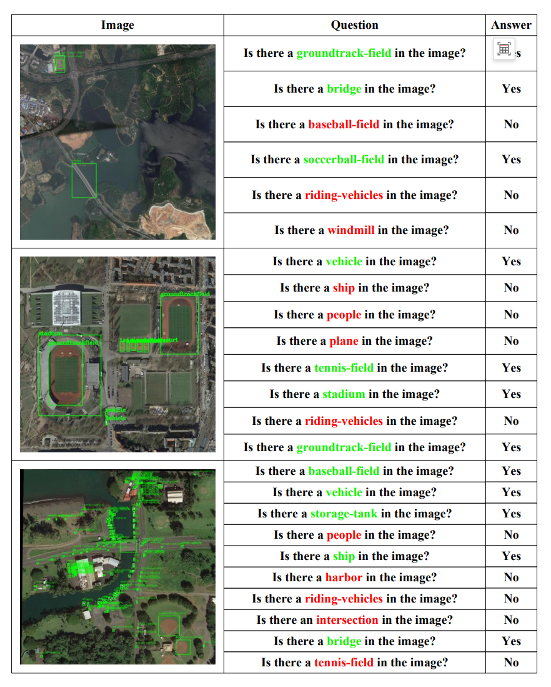

# DDFAV: Remote Sensing Large Vision Language Models Dataset and Evaluation Benchmark
This repository contains the instruction set, evaluation method files and corresponding pictures I made.
## DDFAV Instruction Set

This is an example of an instruction set I made. The rest of the instruction sets and corresponding pictures are in the DDFAV_Instruction Set folder.

Each remote sensing image instruction set generates 8 questions, including a detailed description of the image, a complex question reasoning, two visual question answering tasks for color, two visual question answering tasks for counting, and two visual question answering tasks for object location.
## RSPOPE Hallucination Assessment Method

This is an example of the RSPOPE hallucination evaluation method I made. The rest of the evaluation files and corresponding pictures are in the rspope_evaluation folder.

There are 9 settings (easy, meidum, hard) and (random, popular, adversarial) in total. Based on the original POPE random, popular, adversarial settings, the easy setting requires at least 2 different types of objects, the number of objects is within 5,
and each image contains 6 binary classification problems; the medium setting requires at least 3 different types of objects, the number of objects is between 6 and 10, and each image contains 8 binary classification problems; the hard setting requires 
at least 4 different types of objects, the number of objects is more than 11, and each image contains 10 binary classification problems.
## DDFAV Dataset

The DDFAV dataset uses 5 remote sensing datasets including (DIOR, DOTA, FAIR1M, VisDrone-2019, AI-TOD).
